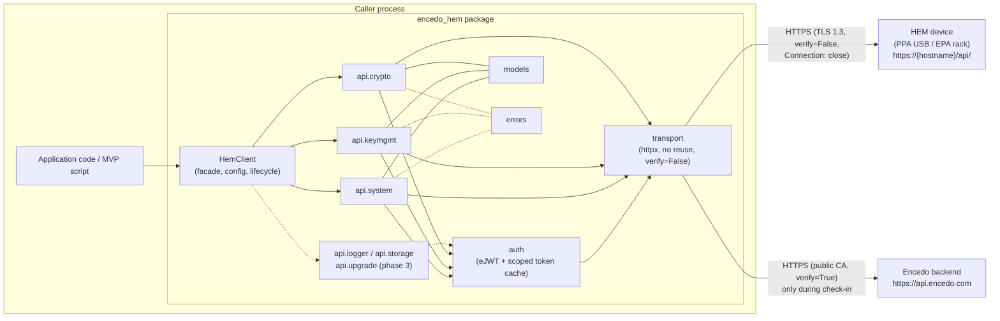
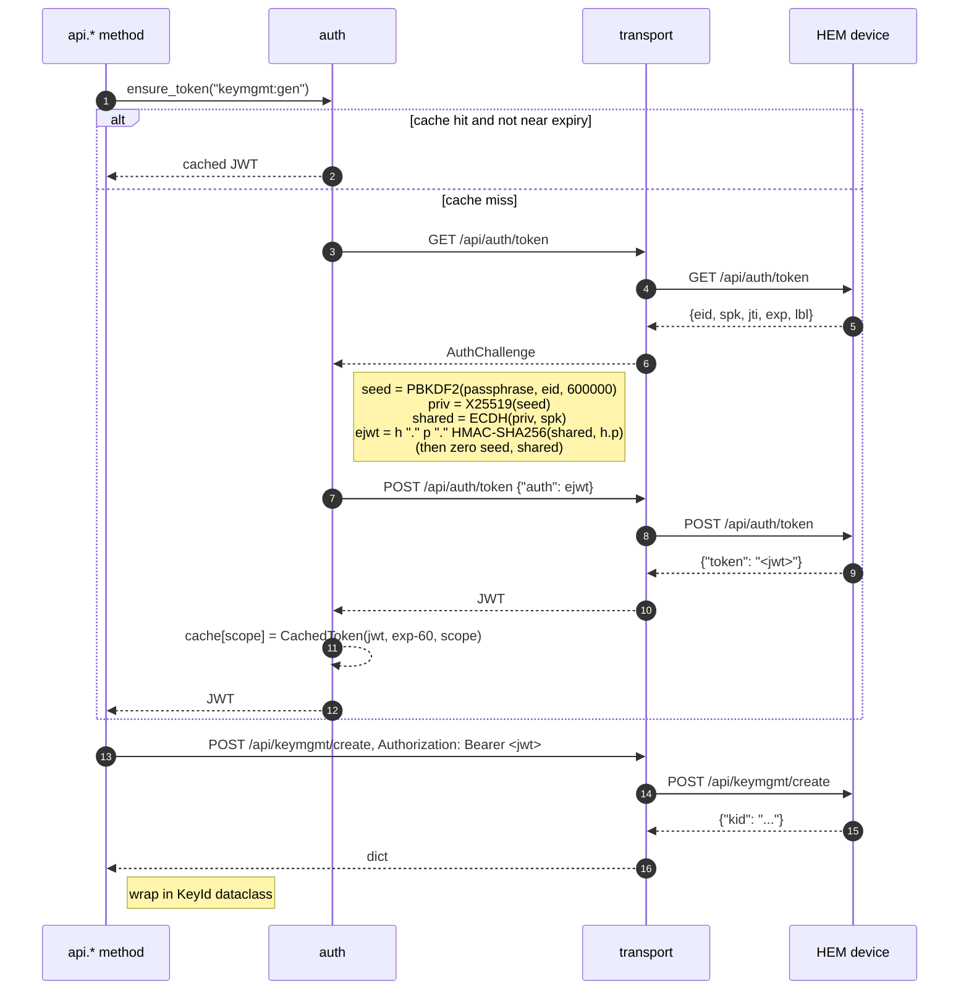

# Architecture: encedo-hem-python-api

## [TLDR]

**Purpose:** A Python client library (PyPI distribution `encedo-hem`, import name `encedo_hem`) that wraps the Encedo HEM (Hardware Encryption Module) REST API, exposing every device endpoint through a simple, typed, Pythonic interface while handling the custom eJWT authentication, token caching, transport quirks, and check-in flow transparently.

**Core components:**
- `encedo_hem.transport` -- thin `httpx` wrapper (per-request connections via `Connection: close`, TLS verification disabled, JSON in/out, 413 pre-flight guard) isolating the device's transport quirks from everything else.
- `encedo_hem.auth` -- eJWT builder + scoped token cache (`ensure_token(scope)`): PBKDF2-SHA256 → X25519 → HMAC-SHA256, automatic re-auth when scope changes or token is near expiry. All authenticated calls go through this.
- `encedo_hem.client.HemClient` -- the top-level object callers hold. Owns config (hostname, passphrase, role, `auto_checkin`, `strict_hardware`), transport, auth cache, and exposes endpoint namespaces (`client.system`, `client.keys`, `client.crypto`, …). Provides convenience helpers (`ensure_ready()`, context-manager support).
- `encedo_hem.api.*` -- one module per REST area (`system`, `auth_flow`, `keymgmt`, `crypto`, and in later phases `logger`, `storage`, `upgrade`). Each module contains small methods that call `auth.ensure_token(scope)` → `transport.request(...)` → parse into typed dataclasses.
- `encedo_hem.models` -- dataclasses for request and response payloads (e.g. `DeviceStatus`, `KeyInfo`, `EncryptResult`). Base64 fields are `bytes` on the Python side; the library encodes/decodes at the boundary.
- `encedo_hem.errors` -- exception hierarchy mapping HTTP statuses to Python exceptions (`HemAuthError` for 401/403, `HemNotFoundError` for 404, `HemDeviceFailureError` for 409/FLS, `HemBadRequestError` for 400, `HemTlsRequiredError` for 418, `HemPayloadTooLargeError` for 413, `HemNotSupportedError` for endpoints not available on the current hardware, `HemTransportError` for everything else).
- `examples/mvp.py` -- the MVP test program required by the brief (status → check-in → create key → encrypt → decrypt → delete key).

**Technology choices:**
- Python 3.10+ -- modern typing (`|` unions, `match`), dataclasses, no hard need to force 3.11+.
- `httpx` for HTTP -- supports per-request connection control, explicit TLS verification flag, typed API, and a clean path to optional async later.
- `cryptography` (pyca) for PBKDF2-SHA256, X25519, HMAC-SHA256 -- actively maintained, audited, ships wheels, covers everything the eJWT flow needs with no extra deps.
- `pytest` + `respx` (httpx mock) for unit tests; a small manual integration harness driven by env vars (`HEM_HOST`, `HEM_PASSPHRASE`) for real-device tests.
- `ruff` (lint + format) and `mypy --strict` for static checks.
- Packaging with `pyproject.toml` (PEP 621) and `hatchling` as the build backend; `uv` as the recommended dev workflow (fast, lockfile-based), but anything that understands standard `pyproject.toml` (plain `pip install -e .`, `poetry`, `hatch`) works unchanged.

**Data flow:**
```
caller → HemClient.<namespace>.<method>(args)
       → auth.ensure_token(required_scope)     # cache hit? reuse; else fetch new
           └─ on miss: transport.get(/api/auth/token) → eJWT build → transport.post(/api/auth/token)
       → transport.request(method, path, json=..., auth=token)  # fresh TCP connection, Connection: close, verify=False
       → device returns JSON
       → map HTTP status → exception (on error) / parse into model dataclass (on success)
       → return typed result to caller
```
The MVP flow layers on top: `client.ensure_ready()` calls `system.status()`, detects missing RTC (`ts is None`), and runs the two-phase check-in automatically (device → api.encedo.com → device). After that, `keys.create(...)`, `crypto.encrypt(...)`, `crypto.decrypt(...)`, `keys.delete(...)` each trigger exactly one auth fetch per distinct scope (one for `keymgmt:gen`, one for `keymgmt:use:<kid>`, one for `keymgmt:del`).

**Key architectural decisions:**
- **Sync-only for v1.** Matches the scope of the brief and keeps the dep surface minimal given the device's one-shot-connection behaviour. `httpx` leaves an async door open for a future minor version without redesign.
- **One client = one device.** No multi-device pool or session manager. Callers instantiate `HemClient(host, passphrase, role=USER)` and use it; thread-safety is explicitly out of scope for v1 (one client per thread).
- **Scope-driven auto-auth, not manual login.** Every authenticated endpoint declares the scope it needs; `auth.ensure_token()` is the single chokepoint that fetches/reuses tokens. Callers never call `login()` directly. This mirrors the `hem_auth_ensure` pattern from the C reference.
- **Automatic check-in, opt-out via flag.** `HemClient` defaults to `auto_checkin=True`: on first authenticated call (or explicit `ensure_ready()`) the client reads `system.status()`, and if `ts is None` (RTC not set) it runs the two-phase check-in against `api.encedo.com` transparently. Set `auto_checkin=False` to disable; the caller can then drive `client.system.checkin()` manually. Mirrors the "QoL: automatically providing check-in" requirement from the brief.
- **Hardware detection with escape hatch.** On first `ensure_ready()` the client reads `/api/system/version` and caches the form factor (PPA vs EPA) from `hwv`. Endpoints known to be hardware-specific (e.g. `storage.*`, `logger.list`, `logger.get`, `system.shutdown`, `upgrade.upload_ui`) raise `HemNotSupportedError` locally before even hitting the wire when called on the wrong form factor. `HemClient(strict_hardware=False)` disables this check and lets every call reach the device (which will return 404 on its own) — useful for diagnostic/DIAG firmware or for future hardware revisions whose `hwv` string is unknown to the library.
- **Endpoints grouped by REST area, not by flat function list.** `client.system.status()` reads better than `client.system_status()` and matches the REST URL structure, making the mapping between docs and code obvious.
- **Typed models over raw dicts.** All endpoint returns are dataclasses. Base64 fields are `bytes` on the Python side; the library handles encode/decode at the boundary so callers pass and receive raw bytes.
- **Errors are exceptions, not return codes.** Every non-2xx device response raises a specific `HemError` subclass; 401 triggers one automatic retry after re-auth and then re-raises.
- **Phased scope.** Phase 1 (MVP) ships `system` + `auth` + `keymgmt` + `crypto.cipher` — exactly what the MVP script needs. Phase 2 adds HMAC/ExDSA/ECDH/PQC. Phase 3 adds `logger`, `storage`, `upgrade`. External (remote) authentication is deferred to Phase 4; the broker flow is now documented (OQ-1/2/3 resolved 2026-04-14) but implementation requires cloud integration testing.
- **Sensitive material hygiene.** Passphrase held in a single buffer on the client, zeroed on `close()`. PBKDF2 seed and ECDH shared secret are local variables in `auth.build_ejwt()` and overwritten after use (best-effort in Python, but documented).

---

## System Overview

`encedo-hem` is an **in-process client library**, not a service. The only runtime it runs inside is the caller's own Python process. Its architectural style is a layered facade: a thin public object (`HemClient`) on top, endpoint-specific API modules in the middle, and two cross-cutting primitives (`transport` and `auth`) at the bottom. Each layer only knows about the one directly below it.

The library sits between a caller (an application, a CLI, a test script) and **two** external systems:

1. The **HEM device** itself — REST API over HTTPS at `https://{hostname}/api/`, self-signed cert, one TCP connection per request, eJWT-based auth.
2. The **Encedo backend** at `https://api.encedo.com` — used only during the two-phase check-in flow (device → backend → device). Uses a normal public CA, so TLS verification stays enabled for this target.



The arrow from each API module to `auth` represents *scope enforcement*: API methods call `auth.ensure_token(scope)` as their first line and receive back a bearer token. The arrow from each API module to `transport` represents the request itself — `auth` is not in the data path for the payload, only for obtaining the credential.

---

## Components

### `encedo_hem.transport`

- **Responsibility:** Own the `httpx.Client`, speak HTTPS to the device and (when needed) to the Encedo backend, serialise/deserialise JSON, translate HTTP status codes into exceptions, and absorb the device's transport quirks so that no other module ever has to think about them.
- **Technology:** `httpx` — chosen for typed API, per-request header overrides, explicit `verify` control, and a clean async path if we want it later.
- **Interfaces:**
  - `Transport.request(method: str, path: str, *, json: dict | None = None, token: str | None = None, binary: bytes | None = None, verify: bool = False) -> dict` — the one chokepoint all REST calls go through.
  - `Transport.backend_post(url: str, json: dict) -> dict` — used only for the check-in bounce to `api.encedo.com` (different base URL, TLS verify *on*).
  - `Transport.close()` — releases the underlying httpx client.
- **Data:** Stateless except for the httpx client handle and the base URL. No caching, no retries beyond the single "401 → refresh token → retry once" handled higher up.
- **Device quirks it encodes:**
  - `verify=False` for the device target (self-signed cert).
  - `Connection: close` header on every device request, and `limits=httpx.Limits(max_keepalive_connections=0)` on the underlying client — the device's embedded HTTP server drops the TCP connection after every response, so any keep-alive attempt fails with a `ConnectionError` on the next POST (documented in `INTEGRATION_GUIDE.md` §2.2).
  - 7300-byte POST body pre-flight: serialises the JSON payload, measures its encoded length, and raises `HemPayloadTooLargeError` locally before spending an RTT on the device (the device itself returns 413; we catch it at the boundary to give the caller the size budget back in the error message).
  - HTTP-status-to-exception mapping lives here (not in each API module) so behaviour stays consistent.

### `encedo_hem.auth`

- **Responsibility:** Everything around the custom eJWT protocol — build the signed auth payload, request access tokens, cache them keyed by scope, and decide when a cached token is still good.
- **Technology:** `cryptography` (pyca) for `PBKDF2HMAC(SHA256, iterations=600000)`, `X25519PrivateKey.from_private_bytes`, `X25519PrivateKey.exchange`, and `hmac.HMAC(key, SHA256)`. Pure stdlib for base64 (both `urlsafe_b64encode` — stripped of padding — for the JWT segments, and `b64encode` for the standard-base64 fields).
- **Interfaces:**
  - `Auth.ensure_token(scope: str) -> str` — the hot path. Returns a cached token if one exists for `scope` and is not within 60 s of expiry; otherwise runs the full challenge-response flow and stores the result.
  - `Auth.invalidate(scope: str | None = None)` — drops a cached token (or all of them); called by the 401-retry logic in API methods.
  - `Auth.build_ejwt(challenge: AuthChallenge, scope: str, passphrase: bytes) -> str` — pure function, deterministic given inputs; isolated for unit testability against known test vectors.
- **Data:** In-memory `dict[str, CachedToken]` keyed on scope string. `CachedToken` holds the JWT, its `exp`, and the scope. Passphrase lives on `HemClient`, not here — `auth` borrows it for the duration of `ensure_token` and does not retain it.
- **KDF note:** The library uses **PBKDF2-SHA256** (600,000 iterations) as the KDF, matching the HEM API test suite. The Encedo Manager web UI uses **Argon2** (time=10, mem=8192) instead. The device accepts tokens from both KDFs — authentication is KDF-agnostic — but the KDF used must match the one that was active during `auth/init` (device personalization). If the device was initialized via the Encedo Manager, an Argon2 path would be needed; this is not implemented in v1.
- **Security rules it enforces:**
  - Passphrase never appears in logs, tracebacks, or exception messages.
  - PBKDF2 seed and ECDH shared secret are bound to local variables and zeroed via `bytearray` overwrite before `build_ejwt` returns (best-effort in Python; documented as such).
  - Cached tokens treated as expired 60 s before their nominal `exp` to absorb clock skew and network RTT (per `INTEGRATION_GUIDE.md` §3.5).
  - `lbl` from the challenge is surfaced to the client as `HemClient.username` per OQ-4's resolution.

### `encedo_hem.client.HemClient`

- **Responsibility:** The single object a caller holds. Owns configuration, transport, auth cache, form-factor detection, and the auto-check-in lifecycle. Exposes the endpoint namespaces.
- **Technology:** Plain Python class, implements `__enter__` / `__exit__` for `with HemClient(...) as hem:` usage.
- **Interfaces:**
  - `HemClient(host: str, passphrase: str, *, role: Role = Role.USER, auto_checkin: bool = True, strict_hardware: bool = True, timeout: float = 30.0, logger: logging.Logger | None = None)`
  - Namespaces: `.system`, `.auth_flow` (init/pair/remote-login — Phase 4), `.keys`, `.crypto`, `.logger`, `.storage`, `.upgrade`. Unimplemented namespaces raise `NotImplementedError` on first attribute access.
  - `.ensure_ready()` — idempotent; runs version probe + optional check-in; safe to call multiple times. First authenticated endpoint call triggers this automatically.
  - `.username` (from `lbl`), `.hardware` (enum: `PPA | EPA | UNKNOWN`), `.firmware_version` — cached metadata.
  - `.close()` — zeroes the passphrase buffer, closes transport.
- **Data:** Holds the passphrase bytes, a `ReadyState` flag (not-ready / version-checked / ready), the cached `DeviceVersion` result, the cached `DeviceStatus` from the readiness probe, and the form-factor.

### `encedo_hem.api.system`

- **Responsibility:** All `/api/system/*` endpoints — `version`, `status`, `checkin` (both phases), `config` (get/set), `reboot`, `shutdown` (PPA only), `selftest`.
- **Interfaces (Phase 1 subset):**
  - `version() -> DeviceVersion` — unauthenticated.
  - `status() -> DeviceStatus` — unauthenticated; `ts` is `Optional[str]` (ISO 8601, e.g. `"2022-03-16T18:17:27Z"`), `initialized` is derived from the **absence** of the `inited` key (inverted logic per `INTEGRATION_GUIDE.md` §8.1).
  - `checkin() -> None` — runs the full three-step bounce: `GET /api/system/checkin` → `POST https://api.encedo.com/checkin` → `POST /api/system/checkin`. Forwards the opaque blobs verbatim.
  - `config() -> DeviceConfig` — scope `system:config`.
- **Data:** None — everything returned is a fresh dataclass built from the JSON response.

### `encedo_hem.api.keymgmt`

- **Responsibility:** All `/api/keymgmt/*` endpoints — `create`, `derive`, `import`, `list`, `get`, `update`, `search`, `delete`.
- **Interfaces (Phase 1 subset):**
  - `create(label: str, type: KeyType, *, descr: bytes | None = None, mode: KeyMode | None = None) -> KeyId` — scope `keymgmt:gen`. For NIST ECC key types (`SECP*`), if `mode` is omitted we default to `KeyMode.ECDH_EXDSA`; the device's own default is ECDH-only, which silently breaks signing (OQ-19). We preempt that by making the library default permissive and documenting the behaviour.
  - `list(*, page_size: int = 10) -> Iterator[KeyInfo]` — scope `keymgmt:list`. Auto-paginates via `offset`; treats 15 as the device's effective maximum page size (OQ-17) and always uses `offset + listed >= total` as the end-of-list signal rather than `listed < requested_limit`.
  - `get(kid: KeyId) -> KeyDetails` — scope **`keymgmt:use:<kid>`** (OQ-16: spec scope is `keymgmt:get`, not `keymgmt:list` as originally documented; firmware v1.2.2-DIAG only accepts `keymgmt:use:<kid>` empirically, so we use the narrow scope that works everywhere).
  - `update(kid: KeyId, *, label: str, descr: bytes | None = None) -> None` — scope `keymgmt:upd`. `label` is mandatory on the wire even for descr-only updates (OQ-18), so the library signature reflects that: `label` is positional-required.
  - `delete(kid: KeyId) -> None` — scope `keymgmt:del`. Surfaces FLS-failure (HTTP 409) as `HemDeviceFailureError`.
- **Data:** None. The `KeyInfo.type` field is parsed from the comma-separated attribute string (`"PKEY,ECDH,ExDSA,SECP256R1"`) into a structured `ParsedKeyType(flags=..., algorithm=...)` dataclass so callers don't string-split.

### `encedo_hem.api.crypto`

- **Responsibility:** All `/api/crypto/*` endpoints. Phase 1 implements `cipher.encrypt` and `cipher.decrypt`; Phase 2 adds `hmac.*`, `exdsa.*`, `ecdh`, `pqc.mlkem.*`, `pqc.mldsa.*`.
- **Interfaces (Phase 1 subset):**
  - `cipher.encrypt(kid: KeyId, plaintext: bytes, *, alg: CipherAlg = CipherAlg.AES256_GCM, aad: bytes | None = None) -> EncryptResult` — scope `keymgmt:use:<kid>`. Returns `EncryptResult(ciphertext, iv, tag)` with `iv`/`tag` as `Optional[bytes]` (populated only for GCM/CBC and GCM respectively).
  - `cipher.decrypt(kid: KeyId, ciphertext: bytes, *, alg: CipherAlg, iv: bytes | None = None, tag: bytes | None = None, aad: bytes | None = None) -> bytes` — returns the raw plaintext.
- **Data:** None. Base64 encode/decode happens at the module boundary.

### `encedo_hem.models`

Plain `@dataclass(frozen=True, slots=True)` definitions. Representative:

```python
@dataclass(frozen=True, slots=True)
class DeviceStatus:
    fls_state: int
    ts: str | None           # ISO 8601 string; None when RTC unset
    hostname: str | None     # absent when Host header matches device hostname
    https: bool | None       # HTTPS availability; absent in some contexts
    initialized: bool        # True when 'inited' key is ABSENT
    format: str | None
    uptime: int | None
    temp: int | None
    storage: list[str] | None  # PPA only

@dataclass(frozen=True, slots=True)
class EncryptResult:
    ciphertext: bytes
    iv: bytes | None
    tag: bytes | None
```

### `encedo_hem.errors`

```
HemError                       (base)
├── HemTransportError          (connection refused, TLS handshake, timeout)
├── HemBadRequestError         (400)
├── HemAuthError               (401, 403)
│   └── HemRtcNotSetError      (403 on auth challenge — device RTC not set, run checkin)
├── HemNotFoundError           (404, key-not-found)
├── HemNotSupportedError       (endpoint not available on current hardware)
├── HemNotAcceptableError      (406 -- device already initialised, ECDH too small, duplicate import, etc.)
├── HemDeviceFailureError      (409 -- FLS state non-zero)
├── HemPayloadTooLargeError    (413 + local pre-flight guard, carries size_limit + size_actual)
└── HemTlsRequiredError        (418 -- crypto endpoints need TLS, device not yet provisioned)
```

Every exception carries `.status_code`, `.endpoint`, and the parsed response body (when present) for debuggability.

---

## State & Data Architecture

A client library has no database. The only state it holds is the handful of in-memory caches `HemClient` needs to avoid unnecessary round-trips. The authoritative store for everything (keys, device config, audit logs) is the HEM device itself; the library is deliberately stateless across process restarts.

### What the client caches in memory

| State | Owner | Lifetime | Reason |
|---|---|---|---|
| Passphrase (bytes) | `HemClient` | Until `.close()` | Needed every time a new token must be fetched (scope miss / expiry). |
| Scoped token cache `dict[scope, CachedToken]` | `auth` | Per scope: until 60 s before `exp` | Avoids one extra challenge-response per REST call. |
| `DeviceVersion` (hw/fw/bootloader) | `HemClient` | Lifetime of client | Needed for PPA/EPA detection, never changes during a session. |
| Form factor (`PPA` / `EPA` / `UNKNOWN`) | `HemClient` | Lifetime of client | Derived from `hwv`; drives `HemNotSupportedError`. |
| Last `DeviceStatus` (from readiness probe) | `HemClient` | Until next explicit `status()` call | Used by `ensure_ready()` to decide whether check-in is needed. Not returned to callers from the cache — every `client.system.status()` hits the device. |
| `ReadyState` enum (NOT_READY, VERSION_CHECKED, READY) | `HemClient` | Lifetime of client | Guards auto-check-in so it runs exactly once. |

No cache is ever written to disk. No cache persists across `HemClient` instances. This is a deliberate choice — we never want a stale token, a stale form-factor assumption, or (worst) a stale passphrase to outlive the process that created them.

### Data models

All responses are converted to frozen dataclasses at the `api.*` module boundary. Raw `dict`s and `bytes` never leak out. A representative list:

| Dataclass | Fields (abbreviated) | Returned by |
|---|---|---|
| `DeviceVersion` | `hwv`, `blv`, `fwv`, `fws`, `uis` | `system.version()` |
| `DeviceStatus` | `fls_state`, `ts: str \| None`, `hostname: str \| None`, `https: bool \| None`, `initialized: bool`, `uptime`, `temp`, `storage` | `system.status()` |
| `DeviceConfig` | `eid`, `user`, `email`, `hostname`, `uts` | `system.config()` |
| `AuthChallenge` | `eid`, `spk`, `jti`, `exp`, `lbl` | internal to `auth` |
| `CachedToken` | `jwt`, `scope`, `exp` | internal to `auth` |
| `KeyId` | `str` NewType (32 lowercase hex) | multiple |
| `ParsedKeyType` | `flags: frozenset[str]`, `algorithm: str` | `KeyInfo.type` |
| `KeyInfo` | `kid`, `label`, `type: ParsedKeyType`, `created`, `updated`, `descr: bytes \| None` | `keys.list()`, `keys.search()` |
| `KeyDetails` | `pubkey: bytes`, `type: ParsedKeyType`, `updated` | `keys.get()` |
| `EncryptResult` | `ciphertext: bytes`, `iv: bytes \| None`, `tag: bytes \| None` | `crypto.cipher.encrypt()` |

### Check-in data flow

The check-in flow is the one operation that actually traverses *two* external systems rather than one. It is worth showing end-to-end because it is (a) the most complex non-auth flow in Phase 1, and (b) the piece the brief calls out explicitly as a quality-of-life feature ("automatically providing check-in").

```mermaid
sequenceDiagram
    autonumber
    participant C as Caller
    participant HC as HemClient
    participant T as transport
    participant D as HEM device
    participant B as api.encedo.com

    C->>HC: any first authenticated call<br/>(or ensure_ready())
    HC->>T: GET /api/system/status
    T->>D: GET /api/system/status
    D-->>T: {fls_state, ts?, hostname, ...}
    T-->>HC: DeviceStatus
    alt auto_checkin AND status.ts is None
        HC->>T: GET /api/system/checkin
        T->>D: GET /api/system/checkin
        D-->>T: {"check": "<opaque>"}
        T-->>HC: challenge
        HC->>T: backend_post(https://api.encedo.com/checkin, challenge)
        T->>B: POST /checkin (TLS verify=True)
        B-->>T: {"checked": "<opaque>"}
        T-->>HC: response
        HC->>T: POST /api/system/checkin, response
        T->>D: POST /api/system/checkin
        D-->>T: {"status", "newcrt", "newfws", "newuis"}
        T-->>HC: ok (update signals discarded in Phase 1; Phase 3 surfaces them)
    end
    HC-->>C: (transparent — proceed to the original call)
```

### Authentication data flow



---

## API Design (Python public surface)

The brief is a library, so "API design" means **the Python surface the caller imports**, not a REST spec. The device's REST API is the contract the library consumes; the library publishes a higher-level Pythonic surface on top of it.

### Style

- **Facade + namespaces.** The caller holds one `HemClient`. Every operation lives under a short namespace that matches its REST area: `client.system`, `client.keys`, `client.crypto`, `client.logger`, `client.storage`, `client.upgrade`, `client.auth_flow`.
- **No manual token handling.** There is no `login()` method in the public API. Authentication is implicit: the first endpoint that needs a token triggers the challenge-response flow; subsequent calls with the same scope reuse the cached token.
- **Synchronous.** Every method is a plain blocking function. Async is non-goal for v1.
- **Typed inputs, typed outputs.** Enums (`Role`, `KeyType`, `KeyMode`, `CipherAlg`) instead of magic strings; dataclasses instead of dicts; `bytes` instead of base64 strings.
- **Exceptions, not return codes.** Success → return value. Failure → raise a subclass of `HemError`. No `(ok, result)` tuples, no `None`-on-error.
- **Iterators for paginated resources.** `client.keys.list()` yields `KeyInfo` lazily and handles the 15-key page cap internally.
- **Context-manager friendly.** `with HemClient(...) as hem:` is the recommended pattern.

### Canonical example (the MVP, in full)

```python
from encedo_hem import HemClient, KeyType, KeyMode, CipherAlg
import os, secrets

with HemClient(host="my.ence.do", passphrase=os.environ["HEM_PASS"]) as hem:
    # 1. Print device status (auto-calls ensure_ready → version + status,
    #    and transparently runs check-in if RTC is unset).
    status = hem.system.status()
    print(f"hostname={status.hostname} fls={status.fls_state} "
          f"initialized={status.initialized} ts={status.ts}")

    # 2. Force an explicit check-in regardless.
    hem.system.checkin()

    # 3. Create an AES-256 key (default mode covers both ECDH and ExDSA
    #    where applicable; here it's plain AES so mode is ignored).
    kid = hem.keys.create(label="mvp-example", type=KeyType.AES256)
    print(f"created kid={kid}")

    try:
        # 4. Encrypt a random 64-byte message with AES-256-GCM.
        plaintext = secrets.token_bytes(64)
        enc = hem.crypto.cipher.encrypt(kid, plaintext, alg=CipherAlg.AES256_GCM)
        print(f"ciphertext={len(enc.ciphertext)}B iv={len(enc.iv)}B tag={len(enc.tag)}B")

        # 5. Decrypt and verify round-trip.
        recovered = hem.crypto.cipher.decrypt(
            kid, enc.ciphertext, alg=CipherAlg.AES256_GCM, iv=enc.iv, tag=enc.tag,
        )
        assert recovered == plaintext
        print("round-trip OK")
    finally:
        # 6. Always clean up the key, even if encrypt/decrypt raised.
        hem.keys.delete(kid)
        print("deleted")
```

This maps one-to-one to `examples/mvp.py` required by the brief.

### Method inventory (Phase 1)

| Namespace | Method | Scope | REST endpoint |
|---|---|---|---|
| `system` | `version()` | — | `GET /api/system/version` |
| `system` | `status()` | — | `GET /api/system/status` |
| `system` | `checkin()` | — | `GET`+`POST /api/system/checkin` (+ backend bounce) |
| `system` | `config()` | `system:config` | `GET /api/system/config` |
| `system` | `set_config(...)` | `system:config` | `POST /api/system/config` |
| `system` | `reboot()` | `system:config` | `GET /api/system/reboot` |
| `system` | `shutdown()` *(PPA)* | `system:config` | `GET /api/system/shutdown` |
| `system` | `selftest()` | `system:config` | `GET /api/system/selftest` (polls `kat_busy`) |
| `keys`   | `create(...)` | `keymgmt:gen` | `POST /api/keymgmt/create` |
| `keys`   | `list()` *(iterator)* | `keymgmt:list` | `GET /api/keymgmt/list/{offset}/{limit}` |
| `keys`   | `get(kid)` | `keymgmt:use:<kid>` | `GET /api/keymgmt/get/{kid}` |
| `keys`   | `update(...)` | `keymgmt:upd` | `POST /api/keymgmt/update` |
| `keys`   | `delete(kid)` | `keymgmt:del` | `DELETE /api/keymgmt/delete/{kid}` |
| `crypto.cipher` | `encrypt(...)` | `keymgmt:use:<kid>` | `POST /api/crypto/cipher/encrypt` |
| `crypto.cipher` | `decrypt(...)` | `keymgmt:use:<kid>` | `POST /api/crypto/cipher/decrypt` |

Phases 2 and 3 extend this inventory without changing existing signatures.

### Backwards compatibility

The library follows **SemVer**. v0.x is pre-stable: signatures may change between minor versions; we'll call it out in `CHANGELOG.md`. v1.0 freezes the public surface — anything not in the public docs (`_`-prefixed names, modules in `encedo_hem._internal`) is fair game to move.

---

## Packaging, Distribution & Development Workflow

This is a single pure-Python library with two runtime dependencies. Infrastructure is light by design.

### Source layout

```
encedo-hem-python-api/
├── pyproject.toml              # PEP 621 metadata, hatchling build backend
├── README.md
├── LICENSE
├── CHANGELOG.md
├── ARCHITECTURE.md             # this file
├── src/
│   └── encedo_hem/
│       ├── __init__.py         # re-exports: HemClient, KeyType, KeyMode, CipherAlg, Role, errors
│       ├── client.py           # HemClient facade
│       ├── transport.py        # httpx wrapper
│       ├── auth.py             # eJWT + token cache
│       ├── models.py           # dataclasses
│       ├── errors.py           # exception hierarchy
│       ├── enums.py            # KeyType, KeyMode, CipherAlg, Role
│       ├── _base64.py          # standard vs base64url helpers (sensitive to padding)
│       └── api/
│           ├── __init__.py
│           ├── system.py
│           ├── keymgmt.py
│           ├── crypto.py       # cipher subnamespace in Phase 1; hmac/exdsa/ecdh/pqc in Phase 2
│           ├── auth_flow.py    # init/pair/remote-login — OQ-1/2/3 resolved; Phase 4
│           ├── logger.py       # Phase 3
│           ├── storage.py      # Phase 3
│           └── upgrade.py      # Phase 3
├── examples/
│   └── mvp.py                  # the MVP script from the brief
├── tests/
│   ├── unit/
│   │   ├── test_auth_vectors.py     # eJWT construction against known-answer vectors
│   │   ├── test_transport.py        # respx-mocked httpx
│   │   ├── test_models.py
│   │   ├── test_errors.py
│   │   └── test_keymgmt_parse.py    # type-string parser
│   └── integration/
│       ├── conftest.py              # skips unless HEM_HOST + HEM_PASSPHRASE set
│       └── test_mvp_flow.py         # runs the MVP against a real device
└── .github/
    └── workflows/
        └── ci.yml                   # ruff, mypy --strict, pytest (unit only)
```

The `src/` layout (not `encedo_hem/` at the repo root) is deliberate: it prevents `import encedo_hem` from accidentally picking up the source tree instead of the installed package during tests, which is a very common source of "works on my machine" bugs.

### `pyproject.toml` sketch

```toml
[project]
name = "encedo-hem"
version = "0.1.0"
requires-python = ">=3.10"
description = "Python client library for the Encedo HEM REST API"
readme = "README.md"
license = { file = "LICENSE" }
authors = [{ name = "..." }]
dependencies = [
    "httpx>=0.27",
    "cryptography>=42",
]

[project.optional-dependencies]
dev = [
    "pytest>=8",
    "respx>=0.21",
    "ruff>=0.5",
    "mypy>=1.10",
]

[build-system]
requires = ["hatchling"]
build-backend = "hatchling.build"

[tool.hatch.build.targets.wheel]
packages = ["src/encedo_hem"]

[tool.ruff]
line-length = 100
target-version = "py310"

[tool.mypy]
strict = true
python_version = "3.10"
```

### Development workflow

Recommended (using `uv`):

```
uv sync --extra dev        # creates .venv, installs locked deps
uv run pytest -q           # unit tests
uv run ruff check .
uv run mypy src
```

Equivalent with plain `pip`:

```
python -m venv .venv && source .venv/bin/activate
pip install -e '.[dev]'
pytest -q && ruff check . && mypy src
```

Both work; the repo doesn't care which one you use. `uv` is strictly faster — that's the only reason to prefer it.

### Continuous integration

One GitHub Actions workflow, three jobs running in parallel on Python 3.10, 3.11, 3.12:

1. `ruff check .` + `ruff format --check .`
2. `mypy --strict src`
3. `pytest -q tests/unit` (no device integration tests in CI — those require real hardware and credentials).

No deployment pipeline in Phase 1. Release is a manual `uv build && uv publish` once we're happy with a tagged version.

### Release & distribution

- Built as a pure-Python wheel (`py3-none-any.whl`) + sdist.
- Published to PyPI as `encedo-hem`.
- Versioning: SemVer, with the version string coming from `pyproject.toml` only (no dynamic `__version__` magic; `encedo_hem.__version__` reads it from `importlib.metadata`).
- `CHANGELOG.md` updated as part of every release PR, grouped under `Added / Changed / Fixed / Removed`.

### Observability

- Every `api.*` method emits a DEBUG log entry naming the endpoint, HTTP method, and whether an auth token fetch happened. No payload bodies. No passphrase. No JWT contents.
- Callers can attach their own `logging.Logger` via `HemClient(logger=...)`. Default logger is `logging.getLogger("encedo_hem")`.
- No metrics or tracing built in. If a caller wants OpenTelemetry they can wrap `HemClient` themselves — the library's surface is small enough that instrumentation doesn't belong inside.

---

## Security Considerations

The library talks to a cryptographic appliance. Security properties are worth spelling out even for a thin client, because the trust boundary is the library's job to defend.

### Trust model

- The **caller's process** is trusted — it holds the passphrase, which is the ultimate authenticator for the device's local user/master role. Anything that can read the process's memory can impersonate the user.
- The **HEM device** is trusted to execute crypto correctly and to protect key material. The library never handles private key bytes.
- The **network path** between caller and device is **not trusted**, but the device's self-signed cert is also not validated. Authenticity is established out-of-band via the check-in / provisioning flow, not via TLS PKI. Confidentiality and integrity come from TLS 1.3 regardless of the cert chain.
- The **Encedo backend** at `api.encedo.com` is trusted only for the narrow purpose of the check-in bounce — we send it the device's opaque challenge blob and forward its opaque response blob back. Neither is interpreted locally.

### TLS verification policy

| Target | `verify` | Rationale |
|---|---|---|
| HEM device (`https://{hostname}/api/...`) | `False` | Self-signed cert or Encedo-CA cert, not rooted in a public trust store. Device identity is established by the check-in protocol. |
| Encedo backend (`https://api.encedo.com/checkin`) | `True` (default) | Normal public CA. Failing to verify here would be a real MITM risk. |

These two targets are handled by two different httpx client configurations inside `transport`, not by globally disabling verification. That boundary is audited in `test_transport.py`.

### Passphrase handling

- Accepted as `str` at the `HemClient(...)` constructor, immediately encoded to `bytes` and stored in a single `bytearray` on the client.
- Never logged, never included in an exception message, never serialised.
- Zeroed via `for i in range(len(buf)): buf[i] = 0` on `.close()` and on the `__exit__` path.
- Python makes this best-effort only (CPython string interning, GC, copy-on-encode). This is documented honestly in the `HemClient` docstring. Callers who need stronger guarantees (hardware-backed secret storage, keyring integration) can supply the passphrase just-in-time from their own secret store; the constructor also accepts a `Callable[[], bytes]` provider so the library never has to hold the passphrase any longer than strictly necessary during a single `ensure_token` call.

### eJWT / ECDH intermediate material

- The 32-byte PBKDF2 seed and the 32-byte ECDH shared secret are held in `bytearray`s local to `auth.build_ejwt()`.
- Both are zeroed before the function returns. This is explicit in the code and verified by a unit test (`test_auth_vectors::test_ejwt_zeroes_intermediates`).
- JWT tokens are **not** treated as sensitive at the same level: they are bearer credentials, but they are short-lived (≤ 1 h), scoped to a single operation class, and appear naturally in memory as part of HTTP requests. We don't try to zero them.

### Scope discipline

The library does not expose a "master scope" shortcut. Every authenticated operation declares the narrowest scope that works for it, and `auth.ensure_token()` fetches exactly that scope. This means:

- A compromised process's live cache never contains a "do anything" token — only tokens matching the operations actually performed so far.
- The `keymgmt:use:<kid>` scopes are KID-scoped, so a leaked token cannot be used to exercise keys other than the ones that were actually in use.

### 401 retry policy

- On HTTP 401 from the device, the library invalidates the cached token for the scope in question and retries the request **exactly once** after a fresh challenge-response.
- If the retry also fails, it raises `HemAuthError`. No retry loops, no exponential backoff — a persistent 401 means the passphrase is wrong or the role is wrong, and retrying cannot help.

### Device failure state (FLS)

- `GET /api/system/status`'s `fls_state` is a bitmask for entropy/integrity/temperature failures.
- The library does not block crypto calls on FLS != 0 automatically — per `INTEGRATION_GUIDE.md` §5.5, temperature failures (`FLS=4`) can transiently trip without affecting crypto. What it does:
  - Surface the FLS state on `HemClient.last_status.fls_state` after any status call.
  - Translate HTTP 409 responses to `HemDeviceFailureError` (which is what `/api/keymgmt/delete` returns when FLS is set).
  - Log a WARNING the first time we see a non-zero `fls_state` in a session.

### Rate limiting / brute-force protection

The device enforces its own protection per the API docs (`POST /api/auth/token`): minimum 500 ms per response, growing to 1500 ms after 3 failed auths, resetting after ~15 s of success. The library does not reproduce this client-side — we trust the device — but we also do not retry 401s in tight loops (see above) so we can't accidentally amplify a lockout.

### Dependency supply chain

- Two runtime deps (`httpx`, `cryptography`). Both are widely used, have active security teams, and ship wheels for common platforms.
- `cryptography` is the critical one. We pin a floor (`>=42`) and let users take newer patch releases. We do not pin an exact version.
- CI includes `pip-audit` (to be added in Phase 1) to flag known CVEs in the resolved lockfile.

### What is explicitly out of scope

- **Hardware attestation verification.** The `genuine` blob is available through `system.config_attestation()` but the library returns it opaque. Verifying it is the caller's responsibility (and depends on Encedo-provided roots we don't ship).
- **Audit log signature verification.** `logger.key()` returns the ED25519 key + nonce + signature but the library does not wrap the Ed25519 verify into a one-liner. Phase 3 will add `logger.verify_entries(...)` as a helper.
- **Multi-process / multi-threaded safety.** One `HemClient` per thread, period. Concurrency beyond that is a caller concern.

---

## Implementation Plan

Work is broken into four phases. Phase 1 is the MVP from the brief — it is **independently deliverable and testable** on its own (the MVP script runs end-to-end against a real device). Each subsequent phase extends the library without changing the Phase 1 public surface.

Dependencies flow top-to-bottom: Phase 0 is prerequisite for everything; Phase 1 is prerequisite for Phases 2 and 3; Phases 2 and 3 are independent of each other and can be done in parallel or reordered.

### Phase 0: Repo scaffolding

**Goal:** A greenlit project skeleton that lint, type-check, and test runners all accept, with one no-op module importable.

**Tasks:**
- [ ] Create `pyproject.toml` (name, version 0.1.0.dev0, deps, build backend, tool configs).
- [ ] Create `src/encedo_hem/__init__.py` with a placeholder `__version__` read via `importlib.metadata`.
- [ ] Create `tests/unit/test_smoke.py` with a single `import encedo_hem` assertion.
- [ ] Create `.github/workflows/ci.yml` running ruff + mypy + pytest on 3.10/3.11/3.12.
- [ ] Create `.gitignore` additions for `.venv/`, `dist/`, `.pytest_cache/`, `.mypy_cache/`, `.ruff_cache/`.
- [ ] `uv sync --extra dev` works locally, `uv run pytest` is green.

**Deliverable:** A green CI run on the first PR. No functionality, just a tested scaffold.

**Dependencies:** None.

---

### Phase 1: MVP — system + auth + keymgmt + cipher

**Goal:** `python examples/mvp.py` runs against a real PPA/EPA, printing status, doing check-in, creating a key, round-tripping an AES-256-GCM message, and deleting the key. This is exactly the MVP checklist from `.ai/app-description.txt`.

**Tasks:**
- [ ] `errors.py`: full exception hierarchy + HTTP-status-to-exception mapping function.
- [ ] `_base64.py`: helpers for standard-base64 (with padding) and base64url-nopad; unit tests against known vectors.
- [ ] `transport.py`:
  - [ ] `Transport` class over `httpx.Client(verify=False, limits=Limits(max_keepalive_connections=0))`.
  - [ ] `Connection: close` header on every device request.
  - [ ] Local 7300-byte pre-flight guard → `HemPayloadTooLargeError`.
  - [ ] `backend_post(url, json)` using a separate httpx client with `verify=True`.
  - [ ] Status-to-exception translation.
- [ ] `models.py`: `DeviceVersion`, `DeviceStatus` (with inverted `initialized` logic), `DeviceConfig`, `AuthChallenge`, `CachedToken`, `KeyId`, `ParsedKeyType`, `KeyInfo`, `KeyDetails`, `EncryptResult`.
- [ ] `enums.py`: `Role`, `KeyType`, `KeyMode`, `CipherAlg`.
- [ ] `auth.py`:
  - [ ] `build_ejwt(challenge, scope, passphrase)` — PBKDF2-SHA256 (600 000 iters) → X25519 → ECDH → HMAC-SHA256 → JWT assembly. Zero the seed and shared secret at function exit.
  - [ ] `Auth` class with `ensure_token(scope)` / `invalidate(scope)` and the 60-second expiry buffer.
  - [ ] Unit tests against fixed vectors (mock challenge, mock passphrase → deterministic eJWT).
- [ ] `api/system.py`: `version`, `status`, `checkin` (full three-step bounce), `config`, `set_config`, `reboot`, `selftest`.
- [ ] `api/keymgmt.py`: `create`, `list` (auto-paginated iterator capped at 15/page), `get` (scope `keymgmt:use:<kid>`), `update` (mandatory label), `delete`.
- [ ] `api/crypto.py`: `cipher.encrypt`, `cipher.decrypt` for ECB/CBC/GCM.
- [ ] `client.py`: `HemClient` facade with `auto_checkin` and `strict_hardware` flags, `ensure_ready()`, namespace attributes, `__enter__`/`__exit__`, `close()` with passphrase zeroing.
- [ ] `examples/mvp.py`: the script in the "Canonical example" section above.
- [ ] `tests/integration/test_mvp_flow.py`: pytest fixture that skips unless `HEM_HOST` and `HEM_PASSPHRASE` are set; runs the full MVP flow.

**Deliverable:** Tagged `v0.1.0`. A user can `pip install encedo-hem`, write the MVP script in the README, point it at their device, and see the round-trip succeed.

**Dependencies:** Phase 0.

---

### Phase 2: Full crypto surface

**Goal:** Cover every `/api/crypto/*` endpoint and every `/api/keymgmt/*` endpoint not yet in Phase 1.

#### 2.1 New enums

New enums in `enums.py`:

```python
class HashAlg(Enum):
    """Hash algorithm for HMAC and ECDH operations."""
    SHA2_256 = "SHA2-256"
    SHA2_384 = "SHA2-384"
    SHA2_512 = "SHA2-512"
    SHA3_256 = "SHA3-256"
    SHA3_384 = "SHA3-384"
    SHA3_512 = "SHA3-512"

class SignAlg(Enum):
    """Signing algorithm for exdsa operations."""
    SHA256_ECDSA = "SHA256WithECDSA"
    SHA384_ECDSA = "SHA384WithECDSA"
    SHA512_ECDSA = "SHA512WithECDSA"
    ED25519 = "Ed25519"
    ED25519PH = "Ed25519ph"
    ED25519CTX = "Ed25519ctx"
    ED448 = "Ed448"
    ED448PH = "Ed448ph"

    @property
    def requires_ctx(self) -> bool:
        """True when the ``ctx`` parameter is mandatory on the wire."""
        return self in {SignAlg.ED25519PH, SignAlg.ED25519CTX, SignAlg.ED448, SignAlg.ED448PH}

class WrapAlg(Enum):
    """AES key-wrap algorithm (RFC 3394). No mode suffix — distinct from CipherAlg."""
    AES128 = "AES128"
    AES192 = "AES192"
    AES256 = "AES256"
```

#### 2.2 New dataclasses in `models.py`

```python
@dataclass(frozen=True, slots=True)
class HmacResult:
    """Result of ``POST /api/crypto/hmac/hash``."""
    mac: bytes  # decoded from base64

@dataclass(frozen=True, slots=True)
class SignResult:
    """Result of ``POST /api/crypto/exdsa/sign`` or ``POST /api/crypto/pqc/mldsa/sign``."""
    signature: bytes  # decoded from base64

@dataclass(frozen=True, slots=True)
class EcdhResult:
    """Result of ``POST /api/crypto/ecdh``."""
    shared_secret: bytes  # decoded from base64, raw or hashed depending on alg

@dataclass(frozen=True, slots=True)
class WrapResult:
    """Result of ``POST /api/crypto/cipher/wrap``."""
    wrapped: bytes  # decoded from base64

@dataclass(frozen=True, slots=True)
class MlKemEncapsResult:
    """Result of ``POST /api/crypto/pqc/mlkem/encaps``."""
    ciphertext: bytes  # decoded from base64, send to peer
    shared_secret: bytes  # decoded from base64, use for symmetric crypto
    alg: str  # MLKEM512, MLKEM768, or MLKEM1024

@dataclass(frozen=True, slots=True)
class MlKemDecapsResult:
    """Result of ``POST /api/crypto/pqc/mlkem/decaps``."""
    shared_secret: bytes  # decoded from base64, matches encapsulator's ss
```

#### 2.3 KeyMgmtAPI additions (`api/keymgmt.py`)

**`derive(kid, label, type, *, descr, ext_kid, mode, pubkey) -> KeyId`** — scope `keymgmt:ecdh`

```
POST /api/keymgmt/derive
{kid, label, type, descr?, ext_kid?, mode?, pubkey?}  →  {kid}
```
- `kid`: source key for ECDH derivation (32-char hex).
- `label`: label for the derived key (max 31 chars).
- `type`: `KeyType` of the new key to create.
- `ext_kid`: on-device external public key for the ECDH peer (mutually exclusive with `pubkey`).
- `pubkey`: raw bytes of external public key (mutually exclusive with `ext_kid`).
- `mode`: `KeyMode` — same OQ-19 defaulting as `create()` for NIST ECC.
- Returns new `KeyId`.

**`import_key(label, pubkey, type, *, descr, mode) -> KeyId`** — scope `keymgmt:imp`

```
POST /api/keymgmt/import
{label, pubkey, type, mode?, descr?}  →  {kid}
```
- `label`: max 31 chars.
- `pubkey`: raw bytes of the public key material.
- `type`: `KeyType` — supported types include all ECC, curve, EdDSA, ML-KEM, and ML-DSA.
- `mode`: `KeyMode` — for NIST ECC, same OQ-19 defaulting as `create()`.
- **OQ-20 quirk:** returns HTTP 406 on duplicate public key. Surface as `HemNotAcceptableError` (existing). Docstring should note the duplicate-key meaning of 406 on this endpoint.
- Named `import_key` to avoid shadowing the `import` keyword.

**`search(descr, *, offset, limit) -> Iterator[KeyInfo]`** — scope `keymgmt:search`

```
POST /api/keymgmt/search
{descr, offset?, limit?}  →  {offset, total, listed, list}
```
- `descr`: base64-encoded search pattern. OQ-7: convention is `'^' + base64(raw_prefix)` where `raw_prefix` is ≥6 bytes.
- Auto-paginated iterator, same pattern as `list()` — calls with increasing `offset`.
- **404 quirk:** device returns HTTP 404 on no match (not an empty list). Catch `HemNotFoundError` internally, yield nothing.
- Page size capped at 15 (same as `list()`).
- Unauthenticated path: if `allow_keysearch` is enabled on device and pattern ≥6 bytes, `Authorization` header may be omitted. For simplicity, always authenticate in v0.2; document the unauthenticated option for v0.3+.

#### 2.4 Crypto sub-namespaces (`api/crypto.py`)

Extend `CryptoAPI.__init__` to wire up new sub-namespaces:

```python
class CryptoAPI:
    def __init__(self, client: HemClient) -> None:
        self.cipher = CipherAPI(client)
        self.hmac = HmacAPI(client)
        self.exdsa = ExdsaAPI(client)
        self.ecdh = EcdhAPI(client)
        self.pqc = PqcAPI(client)
```

All crypto endpoints use scope `keymgmt:use:{kid}`. All `msg` fields have a 2048-byte plaintext limit (before base64). All use standard base64 with padding on the wire.

##### 2.4.1 `HmacAPI` — `client.crypto.hmac`

**`hash(kid, msg, *, alg, ext_kid, pubkey) -> HmacResult`**

```
POST /api/crypto/hmac/hash
{kid, msg, alg?, ext_kid?, pubkey?}  →  {mac}
```
- `alg`: `HashAlg` — optional (device has a default, likely SHA2-256).
- `ext_kid` / `pubkey`: optional, for ECDH-derived HMAC key. HMAC key = `Hash(X25519(kid_priv, peer_pub))` where `Hash` uses `alg`.

**`verify(kid, msg, mac, *, alg, ext_kid, pubkey) -> bool`**

```
POST /api/crypto/hmac/verify
{kid, msg, mac, alg?, ext_kid?, pubkey?}  →  200 (valid) / 406 (invalid)
```
- OQ-12: no response body either way. Returns `True` on 200, `False` on 406.
- Catches `HemNotAcceptableError` (406) internally and returns `False` instead of raising.

##### 2.4.2 `ExdsaAPI` — `client.crypto.exdsa`

**`sign(kid, msg, alg, *, ctx) -> SignResult`**

```
POST /api/crypto/exdsa/sign
{kid, msg, alg, ctx?}  →  {sign}
```
- `alg`: `SignAlg` — **required**.
- `ctx`: raw bytes, max 255 bytes. **Required** when `alg.requires_ctx` is True (`Ed25519ph`, `Ed25519ctx`, `Ed448`, `Ed448ph`). Raise `ValueError` if missing for those algorithms.
- OQ-19: if the key was created without `mode: "ExDSA"` or `"ECDH,ExDSA"`, the device will return 406. Docstring notes this.

**`verify(kid, msg, signature, alg, *, ctx) -> bool`**

```
POST /api/crypto/exdsa/verify
{kid, msg, sign, alg, ctx?}  →  200 (valid) / 406 (invalid)
```
- Same `ctx` requirements as `sign`. Max 255 bytes.
- OQ-12: returns `True` on 200, `False` on 406 (no response body either way).

##### 2.4.3 `EcdhAPI` — `client.crypto.ecdh`

**`exchange(kid, *, pubkey, ext_kid, alg) -> EcdhResult`**

```
POST /api/crypto/ecdh
{kid, pubkey?, ext_kid?, alg?}  →  {ecdh}
```
- Exactly one of `pubkey` (raw bytes) or `ext_kid` (`KeyId`) must be provided. Raise `ValueError` if neither or both.
- `alg`: `HashAlg | None` — if `None`, returns raw ECDH output. If set, returns `Hash(raw)`.
- **Note:** not in Encedo Manager; documented in official docs and registered in scopes. Lower confidence on wire-level behaviour — integration test is the verification gate.

##### 2.4.4 `CipherAPI` additions — `wrap` and `unwrap`

Add to existing `CipherAPI` class:

**`wrap(kid, alg, *, msg) -> WrapResult`**

```
POST /api/crypto/cipher/wrap
{kid, alg, msg?}  →  {wrapped}
```
- `alg`: `WrapAlg` — `AES128`, `AES192`, or `AES256` (not the `-ECB`/`-GCM` forms).
- `msg`: optional raw bytes to wrap. If omitted, device generates random data and wraps it.
- **Constraint:** if provided, `msg` length must be a multiple of 8 bytes and ≥16 bytes (RFC 3394). Validate locally, raise `ValueError` if violated.
- **Note:** official docs page returns 404; schema from HEM test suite. Lower confidence — integration test is the verification gate.

**`unwrap(kid, wrapped, *, alg) -> bytes`**

```
POST /api/crypto/cipher/unwrap
{kid, alg, msg}  →  {unwrapped}
```
- `alg`: `WrapAlg`.
- `wrapped`: raw bytes of the wrapped key material.
- Returns unwrapped plaintext bytes.

##### 2.4.5 `PqcAPI` — `client.crypto.pqc`

```python
class PqcAPI:
    def __init__(self, client: HemClient) -> None:
        self.mlkem = MlKemAPI(client)
        self.mldsa = MlDsaAPI(client)
```

##### 2.4.6 `MlKemAPI` — `client.crypto.pqc.mlkem`

**`encaps(kid) -> MlKemEncapsResult`**

```
POST /api/crypto/pqc/mlkem/encaps
{kid}  →  {ct, ss, alg}
```
- Key must be of type `MLKEM512`, `MLKEM768`, or `MLKEM1024`.
- Returns ciphertext (send to peer), shared secret (use for symmetric crypto), and algorithm name.

**`decaps(kid, ciphertext) -> MlKemDecapsResult`**

```
POST /api/crypto/pqc/mlkem/decaps
{kid, ct}  →  {ss}
```
- `ciphertext`: raw bytes of the encapsulation ciphertext.
- Returns shared secret (should match encapsulator's `ss`).

##### 2.4.7 `MlDsaAPI` — `client.crypto.pqc.mldsa`

**`sign(kid, msg, *, ctx) -> SignResult`**

```
POST /api/crypto/pqc/mldsa/sign
{kid, msg, ctx?}  →  {sign, alg}
```
- Key must be of type `MLDSA44`, `MLDSA65`, or `MLDSA87`.
- `ctx`: optional, max 255 bytes.
- Returns `SignResult` (reuses the same dataclass as `exdsa.sign`).

**`verify(kid, msg, signature, *, ctx) -> bool`**

```
POST /api/crypto/pqc/mldsa/verify
{kid, msg, sign, ctx?}  →  200 (valid) / 406 (invalid)
```
- `ctx`: optional, max 64 bytes (note: smaller limit than `sign`'s 255).
- OQ-12: returns `True`/`False` based on status code.

#### 2.5 `__init__.py` exports

Add to `__init__.py` imports and `__all__`:
- Enums: `HashAlg`, `SignAlg`, `WrapAlg`.
- Models: `HmacResult`, `SignResult`, `EcdhResult`, `WrapResult`, `MlKemEncapsResult`, `MlKemDecapsResult`.

#### 2.6 Tests

**Unit tests** (respx-mocked, one file per sub-namespace):
- [ ] `tests/unit/test_keymgmt_derive.py` — mock 200 response, verify `KeyId` returned, verify scope is `keymgmt:ecdh`, verify body fields.
- [ ] `tests/unit/test_keymgmt_import.py` — mock 200 response, verify `KeyId` returned, verify scope is `keymgmt:imp`. Test 406 duplicate → `HemNotAcceptableError`.
- [ ] `tests/unit/test_keymgmt_search.py` — mock paginated response. Test 404-on-empty yields nothing. Test `descr` encoding.
- [ ] `tests/unit/test_crypto_hmac.py` — mock hash response, verify base64 decoding. Test verify returns `True` on 200, `False` on 406.
- [ ] `tests/unit/test_crypto_exdsa.py` — mock sign response, verify `SignResult`. Test verify 200/406 → bool. Test `ctx` required for `Ed25519ph` (raises `ValueError` if missing).
- [ ] `tests/unit/test_crypto_ecdh.py` — mock response, verify `EcdhResult`. Test ValueError when neither/both `pubkey`/`ext_kid` given.
- [ ] `tests/unit/test_crypto_wrap.py` — mock wrap/unwrap. Test wrap constraint validation (8-byte multiple, ≥16). Test `WrapAlg` values on wire.
- [ ] `tests/unit/test_crypto_pqc.py` — mock mlkem encaps/decaps and mldsa sign/verify. Test verify bool semantics.

**Integration test** (`examples/crypto_smoke.py`):
- [ ] One key per algorithm family: AES256 (cipher + wrap/unwrap), SECP256R1 (sign/verify + ECDH), ED25519 (sign/verify), SHA2-256 (HMAC hash/verify), MLKEM768 (encaps/decaps), MLDSA65 (sign/verify).
- [ ] Each test: create key → exercise operation → verify round-trip → delete key.
- [ ] Skips PQC tests if device firmware doesn't support those key types (catches 400 on create).

#### 2.7 Scope reference table

| Method | Endpoint | Scope |
|---|---|---|
| `keys.derive()` | `POST /api/keymgmt/derive` | `keymgmt:ecdh` |
| `keys.import_key()` | `POST /api/keymgmt/import` | `keymgmt:imp` |
| `keys.search()` | `POST /api/keymgmt/search` | `keymgmt:search` |
| `crypto.hmac.hash()` | `POST /api/crypto/hmac/hash` | `keymgmt:use:{kid}` |
| `crypto.hmac.verify()` | `POST /api/crypto/hmac/verify` | `keymgmt:use:{kid}` |
| `crypto.exdsa.sign()` | `POST /api/crypto/exdsa/sign` | `keymgmt:use:{kid}` |
| `crypto.exdsa.verify()` | `POST /api/crypto/exdsa/verify` | `keymgmt:use:{kid}` |
| `crypto.ecdh.exchange()` | `POST /api/crypto/ecdh` | `keymgmt:use:{kid}` |
| `crypto.cipher.wrap()` | `POST /api/crypto/cipher/wrap` | `keymgmt:use:{kid}` |
| `crypto.cipher.unwrap()` | `POST /api/crypto/cipher/unwrap` | `keymgmt:use:{kid}` |
| `crypto.pqc.mlkem.encaps()` | `POST /api/crypto/pqc/mlkem/encaps` | `keymgmt:use:{kid}` |
| `crypto.pqc.mlkem.decaps()` | `POST /api/crypto/pqc/mlkem/decaps` | `keymgmt:use:{kid}` |
| `crypto.pqc.mldsa.sign()` | `POST /api/crypto/pqc/mldsa/sign` | `keymgmt:use:{kid}` |
| `crypto.pqc.mldsa.verify()` | `POST /api/crypto/pqc/mldsa/verify` | `keymgmt:use:{kid}` |

#### 2.8 Known risks and lower-confidence items

- **`crypto/ecdh`**: documented but absent from Encedo Manager; no Manager-side usage to cross-reference. Integration test is the only validation path.
- **`cipher/wrap` and `cipher/unwrap`**: official docs return 404; schema from test suite only. Registered in Manager endpoints/scopes but never called from UI. Integration test required.
- **PQC endpoints** (`mlkem`, `mldsa`): not in Manager (newer firmware). Official docs are the sole source. Key creation exists in Manager, but crypto operations don't. Device firmware may not support PQC on older versions — handle gracefully.
- **`mldsa/verify` ctx max size discrepancy**: docs say max 64 bytes for verify vs 255 for sign. Validate locally on both.

#### 2.9 Implementation order

1. Enums + dataclasses (no network, pure additions).
2. `keymgmt` additions (`derive`, `import_key`, `search`) + unit tests — these are straightforward REST wrappers following the Phase 1 pattern.
3. `HmacAPI` + `ExdsaAPI` + unit tests — highest-value crypto additions, well-documented.
4. `CipherAPI` additions (`wrap`/`unwrap`) + unit tests — thin wrappers, lower confidence on wire format.
5. `EcdhAPI` + unit tests — lowest Manager coverage, saved for later.
6. `PqcAPI` (`MlKemAPI` + `MlDsaAPI`) + unit tests — newest firmware features, may not work on all devices.
7. `__init__.py` exports, `examples/crypto_smoke.py`.

**Deliverable:** `v0.2.0`. A caller can use any crypto endpoint the device exposes (except external auth).

**Dependencies:** Phase 1.

---

### Phase 3: Admin, storage, upgrade, logger

**Goal:** Everything except remote authentication.

**Tasks:**
- [ ] `api/logger.py`: `key` (audit log public key), `list` (PPA), `get` (PPA), plus a helper that verifies the Ed25519-signed nonce to prove the key came from this device.
- [ ] `api/storage.py`: `unlock`, `lock` for disk0/disk1 (PPA only, `HemNotSupportedError` on EPA).
- [ ] `api/upgrade.py`: `upload_fw` / `check_fw` / `install_fw` and the `_ui` equivalents, using the newly-documented `application/octet-stream` + `Content-Disposition` transport (OQ-9 resolved).
- [ ] `api/system.py`: `shutdown` (PPA), `config_attestation`, `config_provisioning`.
- [ ] Binary-body path in `transport.py` (`Transport.post_binary(path, body, filename, token)`).
- [ ] Tests for each.

**Deliverable:** `v0.3.0`. Near-complete device coverage.

**Dependencies:** Phase 1. Independent of Phase 2.

---

### Phase 4: External (remote) authentication

**Goal:** Implement `auth_flow.pair()` and `auth_flow.remote_login()`.

OQ-1/2/3 were resolved on 2026-04-14 — the broker URLs, flow sequence, and
`epk` origin are now documented in `encedo-hem-api-doc`. The full login
sequence — including cloud polling via `GET notify/event/check/{eventid}`
and cleanup via `DELETE notify/event/{eventid}` — is fully specified.

**Tasks:**
- [ ] `api/auth_flow.py::pair()`: `GET /api/system/config` (for eid) → `POST https://api.encedo.com/notify/session` (get `epk`) → `POST /api/auth/ext/init` (scope `auth:ext:pair`) → `POST https://api.encedo.com/notify/register/init` → wait for mobile → `POST /api/auth/ext/validate` (scope `auth:ext:pair`). Returns `(kid, confirmation_code)`.
- [ ] `api/auth_flow.py::remote_login()`: check-in handshake → `GET https://api.encedo.com/notify/session` (get session+`epk`) → `POST /api/auth/ext/request` (unauthenticated, uses check-in context) → `POST https://api.encedo.com/notify/event/new` → poll cloud for `authreply` → `POST /api/auth/ext/token`. Returns JWT token.
- [ ] New `transport` method for cloud GET requests (notify/session).
- [ ] Integration test against a real device with a paired mobile app.

**Note:** The `ext/init` scope is `auth:ext:pair` (not `system:config` as
previously assumed). The `ext/request` response contains `{authreq, epk}`
(not `{eid, challenge}`). The `ext/validate` response contains `{kid, code}`
(not `{confirmation}`).

**Deliverable:** `v0.4.0` (or later).

**Dependencies:** Phase 1. OQ-1/2/3 fully resolved — no remaining protocol gaps.

---

## Risks & Mitigations

| Risk | Impact | Likelihood | Mitigation |
|---|---|---|---|
| eJWT signature bug (wrong base64 variant, wrong PBKDF2 params, wrong HMAC order) produces 401 from device and blocks every call. | H | M | Unit tests in `test_auth_vectors.py` hit `build_ejwt` with fixed inputs and compare bytes against a reference produced from the C libhem implementation. Zero the intermediates only after the test has copied them out. |
| Device TCP close after response causes intermittent failures if httpx keep-alive isn't fully disabled. | H | M | Set both `limits=Limits(max_keepalive_connections=0)` **and** `Connection: close` header. Integration test repeatedly calls `system.status()` in a loop to catch any regression. |
| TLS verify flag accidentally applied to the Encedo backend path, exposing check-in to MITM. | H | L | Two separate httpx clients in `transport.py`. `test_transport.py::test_backend_verifies_tls` fails if the backend client has `verify=False`. |
| Undocumented device behaviour (like OQ-16 through OQ-20) breaks at integration time and was not caught by unit tests. | M | H | Each known quirk becomes a regression test in `tests/integration/` (skipped when no device). The `OPEN-QUESTIONS.md` file is the source of truth and we update it whenever new behaviour is discovered. |
| Passphrase leaks into a traceback (e.g., via a `__repr__`, a logging call, or an exception message). | H | L | `HemClient.__repr__` is hand-rolled and excludes the passphrase. `errors.HemError` constructor strips known sensitive fields. Unit test `test_errors::test_no_passphrase_in_str` asserts that constructing every error subclass with `passphrase=...` in kwargs does not leak it. |
| Firmware `keymgmt:get` quirk (OQ-16) regresses or behaves differently on a future firmware. | M | M | We already use the narrow `keymgmt:use:<kid>` scope, which is the more-restrictive option; if `keymgmt:get` becomes fully honoured the library still works. |
| List pagination cap of 15 is not per-firmware constant, causing missed keys on a device we haven't tested. | M | L | Pagination loop uses `offset + listed >= total` as the termination condition; any honoured page size from 1 to `total` works. A unit test exercises pages of 1, 10, 15, 16, and 64. |
| `cryptography` wheel unavailable on a caller's platform (very old Linux, unusual CPU). | L | L | Document the requirement. `cryptography` ships manylinux/musllinux/macOS/Windows wheels for all mainstream platforms; the floor is already `>=42` which predates the most recent tightening. |
| Python 3.10 goes EOL during the library's lifetime. | L | M | Track Python's support schedule; bump the floor in a major release. `requires-python` in `pyproject.toml` means pip will refuse to install on unsupported versions rather than silently breaking. |
| External auth protocol fully documented but not yet implemented. | L | M | OQ-1/2/3 fully resolved (2026-04-14). Polling is `GET notify/event/check/{eventid}`, cancel via `DELETE notify/event/{eventid}`, ~900ms cadence. Phase 4 can proceed without protocol discovery. |
| Device in FLS failure state during MVP run produces confusing errors. | L | L | `HemClient.ensure_ready()` logs a WARNING if `fls_state != 0`; the MVP example script prints `fls_state` as its first line so the operator sees the state before anything else happens. |

---

## Decision Log

| Decision | Rationale | Alternatives Considered | Date |
|---|---|---|---|
| Use `httpx` as the HTTP library. | Typed API, explicit TLS verification control, per-request connection limits, clean path to optional async later. | `requests` (simpler, familiar, but in maintenance mode and lacks built-in async); `urllib3` directly (too low-level, would duplicate work). | 2026-04-08 |
| Sync-only public API in v1. | Library scope is a thin wrapper + an MVP script; async adds complexity that buys nothing for the brief. `httpx` leaves the door open for a v2 async surface without redesign. | Async-first (more future-proof but forces every caller into `asyncio`); dual sync+async (2x the tests for 1x the value right now). | 2026-04-08 |
| Python 3.10 as the minimum version. | Gives us `|` union types, `match`, `dataclass(slots=True)`, and modern typing without forcing 3.11+ which is still rolling out on some LTS distros. | 3.9 (common on older LTS but missing `|` types and `match`); 3.11+ (unlocks `Self` and `tomllib` but excludes too many users). | 2026-04-08 |
| `cryptography` (pyca) for all crypto primitives. | Actively maintained, audited, ships wheels, covers PBKDF2-SHA256, X25519, HMAC-SHA256 in one dep. | `PyCryptodome` (older, less-used today, no X25519 until recently); stdlib `hashlib` + hand-rolled X25519 (reinventing reviewed code — bad idea for a security library). | 2026-04-08 |
| `hatchling` as the build backend, `uv` as the recommended dev workflow. | Hatchling is PyPA-maintained and the most standards-aligned backend. `uv` is dramatically faster than `pip` and uses the same `pyproject.toml`, so nothing is locked in. | `setuptools` (still works, but heavier and less standards-first); `poetry` (all-in-one but opinionated lockfile format — harder to mix with plain pip). | 2026-04-08 |
| `src/` layout. | Prevents accidental imports of the source tree during tests and ensures we always test the installed package. | Flat layout (simpler but easy to mask install bugs). | 2026-04-08 |
| Facade + namespace API (`client.system.status()` over `client.system_status()`). | Matches REST URL structure, keeps method names short, makes tab-completion useful, scales gracefully as we add endpoint areas. | Flat method list (simpler import but 40+ methods on one object becomes unreadable fast). | 2026-04-08 |
| Scope-driven auto-auth via `auth.ensure_token(scope)`. | Every authenticated endpoint knows its scope; the single chokepoint means one path to audit for token handling. Mirrors the `hem_auth_ensure` pattern proven in the C libhem. | Explicit `login(scope)` on the caller side (leaks complexity); global token with wildcard scopes (device does not support this). | 2026-04-08 |
| Check-in is automatic by default (`auto_checkin=True`). | The brief calls out "automatically providing check-in" as a QoL requirement. Making it automatic hides the three-step bounce from 99% of callers. | Manual-only (simpler but violates the brief); automatic-without-opt-out (unacceptable — some test scenarios need to control exactly when the device talks to the backend). | 2026-04-08 |
| Hardware detection with `strict_hardware=True` default and opt-out. | Raising `HemNotSupportedError` locally before the wire gives a clean error message instead of a generic 404; opt-out handles DIAG firmware and unknown future revisions. | Always strict (breaks future hardware); never strict (confusing 404s from mismatched endpoints). | 2026-04-08 |
| `keys.get(kid)` uses scope `keymgmt:use:<kid>`, not `keymgmt:get`. | OQ-16: the spec scope is `keymgmt:get` (confirmed by `encedo-hem-api-doc`), not `keymgmt:list` as originally documented. Firmware v1.2.2-DIAG empirically only accepts `keymgmt:use:<kid>`. Using the narrow per-key scope works everywhere and is more restrictive. | `keymgmt:get` (per spec, but unverified on DIAG); `keymgmt:list` (original wrong spec, empirically 403). | 2026-04-08 (updated 2026-04-14) |
| Default NIST ECC key mode is `ECDH,ExDSA` in `keys.create`. | OQ-19 (resolved): omitting `mode` silently creates ECDH-only keys that break signing. HEM test suite confirms all NIST ECC keys use `"ECDH,ExDSA"`. Defaulting to the combined mode matches caller intuition and canonical usage. | Match device default (silently-broken sign); require explicit mode (safe but noisy for every ECC key). | 2026-04-08 (confirmed 2026-04-14) |
| External (remote) authentication deferred to Phase 4 (stubs for now). | OQ-1/2/3 were blocking at design time (2026-04-08) and resolved on 2026-04-14. The broker URLs, flow, and `epk` origin are now documented. Implementation deferred because it requires cloud integration testing and mobile app pairing, not because the protocol is unknown. | Best-guess implementation (no longer necessary — flow is documented); immediate Phase 4 start (possible but deprioritised vs. Phases 2/3). | 2026-04-08 (updated 2026-04-14) |
| `KeyInfo.type` is parsed into `ParsedKeyType(flags, algorithm)` instead of exposed as a string. | The type field is a comma-separated attribute list (`"PKEY,ECDH,ExDSA,SECP256R1"`); callers should not string-split. | Raw string (caller burden, easy to get wrong); full `dataclass(type=KeyType)` (lossy — can't represent the flag combinations). | 2026-04-08 |
| `pytest` + `respx` for unit tests, env-gated integration tests. | `respx` mocks httpx at the transport layer, so we test real request construction without real network. Env-gating keeps CI green when nobody has a device attached. | Record-and-replay fixtures (brittle to header changes); integration tests in CI (requires shared device, flaky). | 2026-04-08 |
